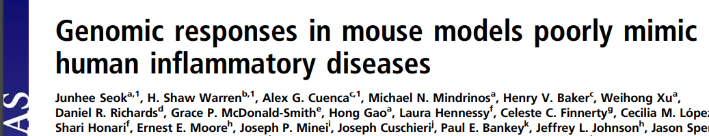
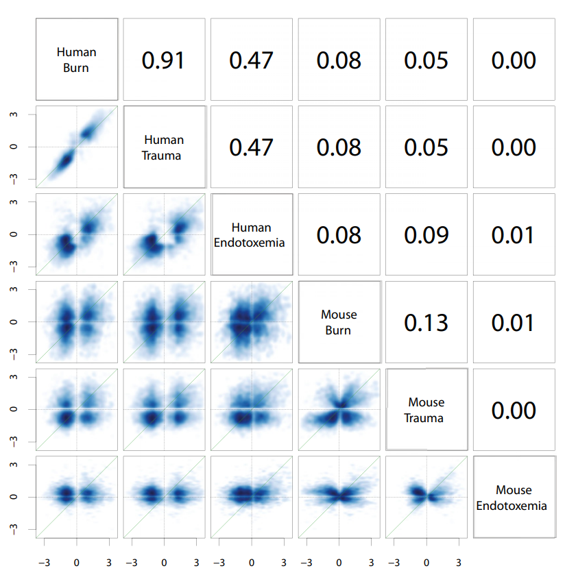

```{r,echo=FALSE}
## Set default options for the knitr RMD processing
knitr::opts_chunk$set(echo=FALSE,warning=FALSE,message=FALSE,fig.width=5,fig.height=5,cache=FALSE,autodep=TRUE, results="hide")
library(pander)
library(knitr)
library(kableExtra)
source("functions.R")
```

```{r echo=FALSE,include=FALSE,eval=TRUE}
options(crayon.enabled = TRUE)
options(crayon.colors = 256)
knitr::knit_hooks$set(output = function(x, options){
  paste0(
    '<pre class="r-output"><code>',
    fansi::sgr_to_html(x = htmltools::htmlEscape(x), warn = FALSE),
    '</code></pre>'
  )
})

## this is an ugly, ugly hack, but otherwise crayon does not LISTEN TO REASON!!!
num_colors <- function(forget=TRUE) 256
library(crayon)
assignInNamespace("num_colors", num_colors, pos="package:crayon")
```


```{r libraries,cache=FALSE}
library(tidyverse)
```


## Of mice and men



---

## Of mice and men

.pull-left[

]

.pull-right[

 * No or little correlation between transcriptomic responses in mouse
   models and human models: $r^2 < 0.1$ – less than 10% of variance
   explained

 * No similarity in identified functions
]
 


---

## Of mice and men


--


---

## Of mice and men

.pull-left[

]

.pull-right[

 * Strong correlation between mouse and human transcriptomic responses for
   genes which are regulated in one or the other condition:
   $\rho \geq 0.5$; change direction correlated

 * Similar functions for similarly regulated genes
]
 


---

## Reproducibility, Repeatability, Replicability


 * **Repeatability:** you can repeat your calculations precisely

.myfootnote[
*McArthur SL. Repeatability, Reproducibility, and Replicability: Tackling
the 3R challenge in biointerface science and engineering.*
]
 
--

 * **Replicability:** Others can repeat your calculations precisely.

--

 * **Reproducibility:** Other approaches to the same problem give
   compatible results.

---

## Of mice and men

.pull-left[


]

--

.pull-right[

 * None of the papers was replicable, because precise description of
   methods leading from data to results was missing. 


 * At best, we were able to *roughly* reproduce the results using guesswork
   and custom code


 * How can we hope for *reproducibile* research if we cannot assure
   *replicable* research?

]

---

## Of mice and men (our story)

Hypothesis: "Genomic responses in mouse models *partly* mimic human
inflammatory diseases"

---

## Of mice and men (our story)


.myfootnote[
*Domaszewska T, Scheuermann L, Hahnke K, Mollenkopf H, Dorhoi A, Kaufmann
SH, Weiner J. Concordant and discordant gene expression patterns in mouse
strains identify best-fit animal model for human tuberculosis. Scientific
reports. 2017 Sep 21;7(1):1-3.*
]

---

## Of mice and men (our story)

.pull-left[


]

.pull-right[
  * numbers in the figure show numbers of concordant / discordant gene
    groups
  * 129S2 mice die when infected with *Mycobacterium tuberculosis*. Their
    responses grow more similar to human responses in the course of
    infection and less similar to C57BL/6 mice.
  * C57BL/6 mice survive the infections. The dissimilarity to human
    responses and 129S2 responses decreases over time.
]

---

## Ensuring replicability

Fist circle of hell: providing detailed information on how to replicate
your results.

.pull-left[
"*...I thought it necessary to deliver things circumstantially, that the
person I addressed them to might, without mistake, and with as little
trouble as possible, be able to repeat such unusual experiments*"

*Robert Boyle, 1627-1691*
]

.pull-right[

]


---
class:empty-slide,myinverse
background-image:url(images/data_analysis_scheme.png)


---
class:empty-slide,myinverse
background-image:url(images/data_analysis_scheme_2.png)

---

## Ensuring replicability

 * publish your code

--

 * make sure that the code *starts* with data exactly as it is available
   for your colleagues (no custom Excel files)

--

 * avoid at all costs any operations that can not be written down as code
   (e.g. editing of spreadsheets in Excel *unless* you want to publish the
   edited versions)

--

 * The code should produce output which is as close to the published
   results (figures, tables etc.) as possible.

--

 * Provide generous instructions on how to run your code, which software or
   R packages need to be installed etc. Make it as simple as possible;
   optimally, it should run without problems with a single simple command.

---

## Ensuring replicability

Second circle of hell: providing detailed information on the software you
have used.


---

## Ensuring replicability: `sessionInfo()`

**Always** include `sessionInfo()` at the end of your report.

```{r echo=TRUE}
sessionInfo()
```

---

```{r echo=FALSE,results="markdown"}
options(width=120)
sessionInfo()
```

---

## Ensuring replicability: other software

 * If possible, use an automated system to include the software version you
   use

--

The following code runs the NCBI program `blastp` with the option
`-version` and captures the output of the program in the variable
`blastp_version`.

```{r echo=TRUE,results="markdown"}
## running in R, so we can include it in Rmarkdown
blastp_version <- system2("blastp", "-version", stdout=TRUE)
blastp_version <- blastp_version[2]
```

--

Then, one can use it directly in Rmarkdown:

```
To search for similar amino acid sequences, we have used the BLASTP program
included in the BLAST package ( ` r blastp_version ` ).
```


--

Output:

To search for similar amino acid sequences, we have used the BLASTP program
included in the BLAST package (`r blastp_version`).

---

## Ensuring replicability

Further five circles of hell: actually making sure that your software will
run.

 * Package versions behave differently and produce different output
 * Even different versions of R may produce different output

--

Solution: 

 * Use a VM / Container / Environment to freeze the state of the software
   (program versions, options etc.)
 * Major downside: takes up a lot of space
 

---

## Ensuring replicability: VMs


Virtual Machines: all software including OS in a single file which can be
moved, archived and "executed". It will freeze the state of every single
component of your analysis pipeline. 

--


E.g. Oracle VM [VirtualBox](https://www.virtualbox.org/) – free, available for Windows, MacOS and Linux,
can run any guest-OS on any host-OS (e.g. Windows on Linux, or Linux on
MacOS etc.).

Windows Substem Linux (WSL) on Windows.

--

.pull-left[
Advantages:

 * portable
 * easy to use
 * ensures 100% software identity
]

.pull-right[
Downsides: 

 * huge performance penalty 
 * images may include proprietary software (e.g. Windows OS), and often cannot be freely published.
]

---
class:empty-slide,myinverse
background-image:url(images/vbox.png)

---

## Ensuring replicability: Containers

Containers: very similar to VM, but do not actually run a virtual
machine. Instead, they depend on the host OS to run your code, but all
software / libraries are contained in the container.


E.g. [Singularity](https://sylabs.io/guides/3.0/user-guide/index.html) (runs on Linux only)

.pull-left[
Advantages:

 * no performance hit
 * portable
 * efficient
 * have many more applications (ensuring portability)
]

.pull-right[
Downsides:

 * much harder to use
 * command-line only
 * basically Linux (running on Windows / MacOS using a VM with Linux)
]

---

## Ensuring replicability: Environments

Environments: lightweight approach to containers. Not all software is
really contained, and the integration (e.g. choosing which software version
to run) happens over environmental variables. 


E.g. [Anaconda](https://www.anaconda.com/): Python-based, works on Linux, MacOS, Windows. Software
packages can be specified with a simple text file, versions can be
selected. The environment is stored in a user directory tree.

--

.pull-left[
Advantages:
 
 * relatively easier to use
 * repeatability: +
 * can be used to describe the installed environment in much detail but in
   a simple text file

]

.pull-right[
Downsides:

 * portability-, replicability- (compared to containers / VMs)
 * package dependency hell
 * package availability might be limited
]


