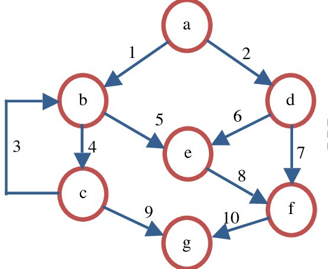

```{r,echo=FALSE}
## Set default options for the knitr RMD processing
knitr::opts_chunk$set(echo=FALSE,warning=FALSE,message=FALSE,fig.width=5,fig.height=5,cache=FALSE,autodep=TRUE, results="hide")
library(pander)
library(knitr)
library(kableExtra)
source("functions.R")
```

```{r echo=FALSE,include=FALSE,eval=TRUE}
options(crayon.enabled = TRUE)
options(crayon.colors = 256)
knitr::knit_hooks$set(output = function(x, options){
  paste0(
    '<pre class="r-output"><code>',
    fansi::sgr_to_html(x = htmltools::htmlEscape(x), warn = FALSE),
    '</code></pre>'
  )
})

## this is an ugly, ugly hack, but otherwise crayon does not LISTEN TO REASON!!!
num_colors <- function(forget=TRUE) 256
library(crayon)
assignInNamespace("num_colors", num_colors, pos="package:crayon")
```


```{r libraries,cache=FALSE}
library(tidyverse)
```

## Literate programming


.pull-left[

*I believe that the time is ripe for significantly better documentation
of programs, and that we can best achieve this by considering
programs to be works of literature. Hence, my title: “Literate
Programming.”*

*Let us change our traditional attitude to the construction of
programs: Instead of imagining that our main task is to instruct a
computer what to do, let us concentrate rather on explaining to
human beings what we want a computer to do.*

(Donald E. Knuth)
]

.pull-right[

]

---

## Coding for others (including yourself)

 * the "future you" will need to understand your code. You think you will
   remember, but you won't.

--

 * Principles of reproducibility require that your code is readable by
   other humans, not only by machines

--

 * Clear, well documented and communicative code will be also easier to
   maintain in future

---

## What makes good communication?

 * **simplicity**: as complex as necessary, but as simple as possible

--

    * try to stick to base R and simple tidyverse as possible
    * avoid complex constructs like object oriented (OO) programming,
      optimizations
    * if you had to google it, it's complex
    * don't shoot sparrows with a canon – often a simpler approach might be
      less elegant, but better understandable

---

## Cyclomatic complexity

.pull-left[
$$M = E - N + 2\cdot P$$

$M$ – complexity, $E$ – number of edges, $N$ – number of nodes, $P$ –
connected components
]

.pull-right[


$10 - 7 + 2 = 5$
]

.myfootnote[
You can check the complexity of your program / package with the `cyclocomp`
package, but the actual important thing here is to understand the concept.
]

---


## What makes good communication?

 * **clarity**

--

    * streamline your code ($A \rightarrow B \rightarrow C$) to make it
      clearer what it does
    * split the operations between lines of code and multiple
      functions (refactorize)
    * avoid re-using variables 
 

---

## What makes good communication?

 * consistency

--

    * use a naming scheme
    * use a standardized documentation format (I mean the comments etc.)
    * decide on a dialect (more on that later)
    * use the same variable names for the same context (e.g. `foo` for a
      throwaway variable, `i` for a counter, `res` for a result)
    * use nouns for variables and verbs for functions, e.g. `linear_model` vs
      `calculate_linear_model()`
    * use `.dot_vars` (variables starting with a dot) to indicate "local"
      or temporary variables (dot is a normal letter, you can call a
      variable `.` - tidyverse does this a lot!).

---

## Naming schemes

You can't use spaces or dashes in variable names.

 * `snake_case` (separate with underscores)
 * `camelCase` or `CamelCase` (`PascalCase`) – some think it is less
   readable (readability studies are inconclusive)

Avoid these:

 * `alllowercase` – not readable
 * `period.separated` – may cause issues with the S3 OO system or R

---


## What makes good communication?

 * Verbosity

--

     * document each function: what does it take as input, what does it
       return
     * document each file: what is this file for
     * document each "significant" or non-obvious variable: what does it
       contain

---
 
## Literate programming

*The practitioner of literate programming can be regarded as an
essayist, whose main concern is with exposition and excellence of
style. Such an author, with thesaurus in hand, **chooses the names of
variables carefully and explains what each variable means**.*

--

*He or she strives for a program that is comprehensible because its concepts
have been introduced in **an order that is best for human understanding**,
using a mixture of formal and informal methods that reinforce each other.*

(Donald E. Knuth)

---

## Dialects in R

Like any human or computer language, R has dialects, false friends (like
"donut" in Germany / Berlin) and multiple ways to express the same.

Like in scientific English, we need to strive for consistency, simplicity
and clarity to 

 * tidyverse vs base R
 * tidyverse (S3, `snake_case`) vs BioConductor (S4, `CamelCase`)
 * base plot vs ggplot2 vs lattice vs... (logic!)
 * `=` vs `<-`

---

## Example: choosing a column from a data frame

```{r, results="hide",echo=TRUE}

## following all do the same
iris[["Sepal.Length"]]
iris$Sepal.Length
iris[[1]]
iris[,1]
iris %>% pull(Sepal.Length)
iris %>% pull("Sepal.Length")
```

(why?)

---

## Example: Object Oriented programming in R


 * Some languages have barebone OO, some have very complex

--

 * In R, we have *everything*

    * S3: simple to use, simple to implement
    * S4: formalized S3 (partly compatible)
    * reference classes: complex, formalized, few programmers are using it

---

## So what is this OO anyway?

 (example of OO in action)


---

## Example: formula notation with `~`


 * In linear modelling it indicates the relationship between covariates and
   dependent variables (e.g. `lm(y ~ x)`)
 * In tidyverse it is a *shorthand* for `function(.x)`


.pull-left[
Base R:

```{r,echo=TRUE,eval=FALSE}
## calculate sums of squares for 
## the first four columns
sapply(iris[,1:4], function(x) sum(x^2))

## same as – dot is just a regular
## variable name
sapply(iris[,1:4], function(.) sum(.^2))
```

]

.pull-right[
Tidyverse:

```{r,echo=TRUE,eval=FALSE}
## the two are identical
map(iris[,1:4], function(.) sum(.^2))
map(iris[,1:4], ~ sum(.^2))
```

]
