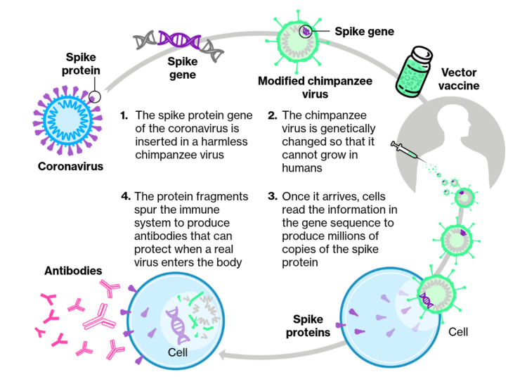
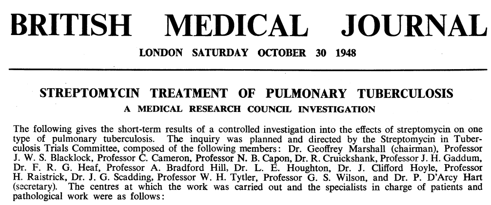
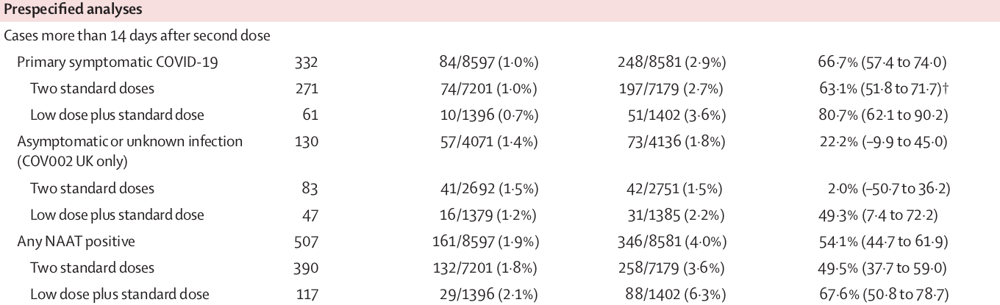
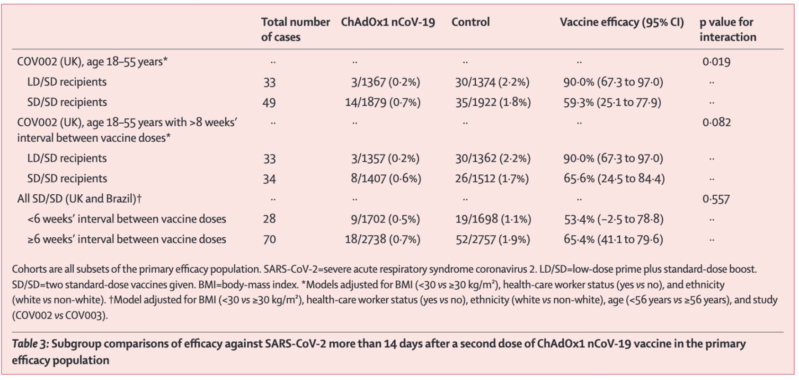
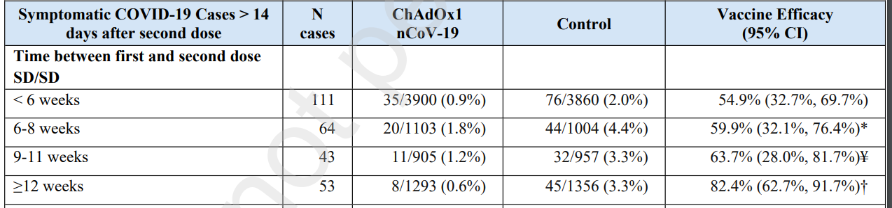
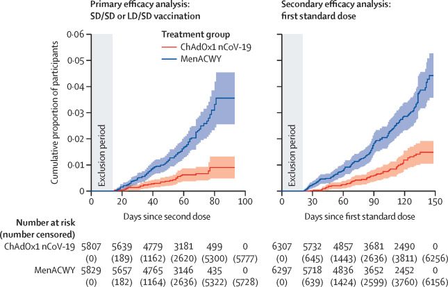

```{r,echo=FALSE}
## Set default options for the knitr RMD processing
knitr::opts_chunk$set(echo=FALSE,warning=FALSE,message=FALSE,fig.width=5,fig.height=5,cache=FALSE,autodep=TRUE, results="hide")
library(pander)
library(knitr)
library(kableExtra)
source("functions.R")
```

```{r echo=FALSE,include=FALSE,eval=TRUE}
options(crayon.enabled = TRUE)
options(crayon.colors = 256)
knitr::knit_hooks$set(output = function(x, options){
  paste0(
    '<pre class="r-output"><code>',
    fansi::sgr_to_html(x = htmltools::htmlEscape(x), warn = FALSE),
    '</code></pre>'
  )
})

## this is an ugly, ugly hack, but otherwise crayon does not LISTEN TO REASON!!!
num_colors <- function(forget=TRUE) 256
library(crayon)
assignInNamespace("num_colors", num_colors, pos="package:crayon")
```


```{r libraries,cache=FALSE}
library(tidyverse)
```

## In the garden of forking paths


.pull-left[
  
]

--

.pull-right[

<q>The problem is there can be a
large number of potential comparisons when the details of data analysis are highly contingent on
data, without the researcher having to perform any conscious procedure of fishing or examining
multiple p-values.</q>

<q>We are not suggesting that researchers generally do [p-hacking].
What we are suggesting is that, given a particular data set, it is not so difficult to look at the data
and construct completely reasonable rules for data exclusion, coding, and data analysis that can
lead to statistical significance [...]</q>

]

.myfootnote[
*Gelman, Andrew, and Eric Loken. "The garden of forking paths: Why multiple
comparisons can be a problem, even when there is no “fishing expedition” or
“p-hacking” and the research hypothesis was posited ahead of time."
Department of Statistics, Columbia University 348 (2013).*
]


---

## The courious case of the ChadOx RCT




???

Chimp virus has been used in research for past ~ 10 years, proving much
more effective than other vectors


---


## The courious case of the ChadOx RCT

 * What is the actual vaccine efficiency?
 * Does it work better/worse in older people?
 * Does a single dose work?
 * Is half a dose better than a full dose?
 * Does it work against new variants?
 * How does it compare to other vaccines?
 * Is it safe?
 * Should you get vaccinated with ChAdOx1?


---

## Real world vs Randomized Controlled trial (RCT)

.pull-left[

"Real world" (observational) studies:

 * comparing apples to oranges
  * problems finding matching controls
  * unknown biases
 * unplanned comparisons
  * the cherry-picking Pandora box

]

--

.pull-right[

RCT:


 * volunteers randomized in two groups
  * groups have now identical characteristcs
  * no bias due to group selection possible
 * planned comparisons prevent cherry-picking




*first RCT published – 1948*

]

???

 - Fisher published his book in 1935
 - Ethics: streptomycin was scarce anyway


---

## The courious case of the ChadOx RCT

 * Multicenter randomized controlled trial

 * Deviations from the original protocol: change to two-dose administration
   mid-trial
 * By mistake, some patients were inoculated with 1/2 of the first dose
 * Time between doses was not controlled and varied
 * Many results are from unplanned comparisons

???

Variable window means shorter observation time for some vaccinees

---

## What is the efficacy of the ChAdOx1 vaccine

 * Original paper: 70% with 95% CI 55-81 (symptomatic cases)

.footnote[*Voysey, Merryn, et al. "Safety and efficacy of the ChAdOx1
nCoV-19 vaccine (AZD1222) against SARS-CoV-2: an interim analysis of four
randomised controlled trials in Brazil, South Africa, and the UK." The
Lancet 397.10269 (2021): 99-111.*]

--

 * Counting also asymptomatic cases: VE drops to 50% (but it still works)
 * Higher proportion of asymptomatic cases in the vaccine arm
    * but possibly due to a mistake (not all positive swabs could be traced
      back to participants)
 * Brazil and UK data was pooled despite several differences

???

What does that CI mean: that in a trial of a vaccine with 55% VE we are
likely to see a result like 70%

---

## Is low dose (LD) better than standard dose (SD)?

 * Original paper reports 90% efficacy for the LD regimen, but...

--

 * ...this is not a result from an RCT!
 * The groups are not comparable
  * LD/SD were all below 55 years old and all from UK, most of them health care workers
  * SD/SD had 20% participants over 55 and half of them were from Brazil,
    only a part of them health care workers
  * timing of the second dose was different
  * All LD/SD were recruited prior to June 10th, all SD/SD were recruited after

???

To be fair, many of these exploratory comparisons were requested by reviewers and
editors

---

## Final results (March 2021)



.footnote[*Voysey, Merryn, et al. "Single-dose administration and the
influence of the timing of the booster dose on immunogenicity and efficacy
of ChAdOx1 nCoV-19 (AZD1222) vaccine: a pooled analysis of four randomised
trials." The Lancet 397.10277 (2021): 881-891.*]


---

## Then, there is this

<span style="font-size:150%">*"Although there is a possibility that chance might play a part in such
divergent results, a similar contrast in efficacy between the LD/SD and
SD/SD recipients with asymptomatic infections provides support for the
observation (58·9% [95% <span>CI 1·0 to 82·9</span>] 
vs 3·8% [<span>−72·4 to 46·3</span>])."*</span>

.footnote[*Voysey, Merryn, et al. "Safety and efficacy of the ChAdOx1
nCoV-19 vaccine (AZD1222) against SARS-CoV-2: an interim analysis of four
randomised controlled trials in Brazil, South Africa, and the UK." The
Lancet 397.10269 (2021): 99-111.*]

???

"These are some crazy, crazy intervals. Sad, sad intervals."

---

## Then, there is this

<span style="font-size:150%">*"Although there is a possibility that chance might play a part in such
divergent results, a similar contrast in efficacy between the LD/SD and
SD/SD recipients with asymptomatic infections provides support for the
observation (58·9% [95% <span style="background-color:yellow">CI 1·0 to 82·9</span>] 
vs 3·8% [<span style="background-color:yellow">−72·4 to 46·3</span>])."*</span>

.footnote[*Voysey, Merryn, et al. "Safety and efficacy of the ChAdOx1
nCoV-19 vaccine (AZD1222) against SARS-CoV-2: an interim analysis of four
randomised controlled trials in Brazil, South Africa, and the UK." The
Lancet 397.10269 (2021): 99-111.*]

???

"These are some crazy, crazy intervals. Sad, sad intervals."


---

## What about the timing between the doses?



???

These comparisons are problematic: no LD/SD < 8 weeks; for SD/SD, huge CI

---


## Timing between the doses in the new paper



 * efficacy does not diminish with increasing distance between the doses
 * hard to say whether the increase is significant


.footnote[*Voysey, Merryn, et al. "Single-dose administration and the
influence of the timing of the booster dose on immunogenicity and efficacy
of ChAdOx1 nCoV-19 (AZD1222) vaccine: a pooled analysis of four randomised
trials." The Lancet 397.10277 (2021): 881-891.*]

---

## Is single dose sufficient?


 * That was not a planned comparison
 * You get different numbers depending on how you calculate the cases
  * 14 days after the first dose? 7? 36?

--




---

## What can be done (1)

 * pre-registration: planning ahead

--

 * pre-publication replication / validation

--

 * Bayesian reasoning / Bayesian statistics


---

## To test or not to test

The conundrum with testing for normality:

 * normality test works in the opposite direction of a regular test: 

    * rejection is the "non-favored" outcome

    * lack of significance "proofs" normality

--

 * if test is underpowered, the data will always appear normal

 * if test is overpowered, the data will *never* appear normal 

 * better: consider your prior (do you have reasons to believe there might
   be an issue with normality?) and use visualization tools / other similar
   data sets


---

.pull-left[
<q>To make the preliminary test on variances [before running a t-test or
ANOVA] is rather like putting to sea in a rowing boat to find out whether
conditions are sufficiently calm for an ocean liner to leave port!</a>

<span style="text-align:right">– George E. P. Box</span>

]

.pull-right[


]


---

## Yule-Simpson effect

---

## Mixed effect models


 * Hierarchical models: when the random effects are "boxed" (e.g. 10 groups
   of 10 students, or repeated measures – one student tested on 10
   occasions)
 * Fully crossed design (e.g.: 10 students evaluate 10 texts)

Advantages:

 * It is incorrect to use fixed effects when the effects are random
 * More efficient: we do not estimate each level for random variables
 
However:

 * We require >= 5 levels per random factor, otherwise use fixed

---

## R package for mixed models: lme4

 * Newer alternative to `nlme`
 * Several other packages build on it
 * Easy to use
 * Allows also for crossed design
 * Tons of usage examples
 * Does not provide p-values (you can use afex::mixed() for this, but maybe
   it is not a good idea)

---


---

## Tips and tricks

 * To "test" for a factor, compare models with `anova`
 * if the model does not converge, use the `all_fit` function from the
   `afex` package to search for an optimizer which works.
 * plot a lot, look at individual cells of data

---

## Tips and tricks
