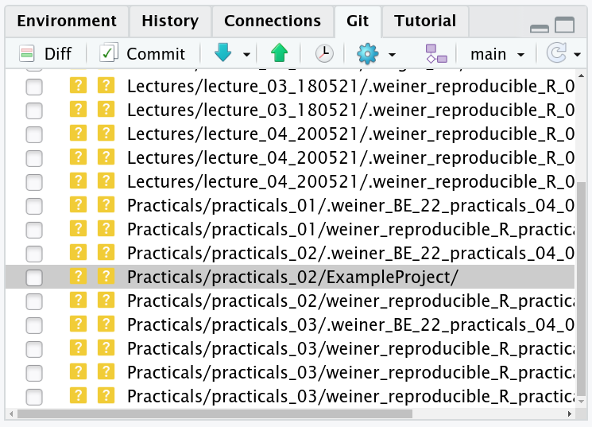

```{r,echo=FALSE}
## Set default options for the knitr RMD processing
knitr::opts_chunk$set(echo=FALSE,warning=FALSE,message=FALSE,fig.width=5,fig.height=5,cache=FALSE,autodep=TRUE, results="hide")
library(pander)
library(knitr)
library(kableExtra)
library(tidyverse)
library(ggthemes)
library(readxl)
source("functions.R")
```

```{r echo=FALSE,include=FALSE,eval=TRUE}
options(crayon.enabled = TRUE)
options(crayon.colors = 256)
knitr::knit_hooks$set(output = function(x, options){
  paste0(
    '<pre class="r-output"><code>',
    fansi::sgr_to_html(x = htmltools::htmlEscape(x), warn = FALSE),
    '</code></pre>'
  )
})

## this is an ugly, ugly hack, but otherwise crayon does not LISTEN TO REASON!!!
num_colors <- function(forget=TRUE) 256
library(crayon)
assignInNamespace("num_colors", num_colors, pos="package:crayon")
```


```{r libraries,cache=FALSE}
library(tidyverse)
```


### Grading

--

Submit an analysis written in Rmarkdown, including all necessary files.
This can be your own research, example analysis, fragment of the course –
anything you like. There is no minimum requirement (e.g. length), but I
require the following:

 * it needs to be Rmarkdown 
 * it must include your own R code.
 * it must work (i.e. generate a HTML, Word or PDF document)

In return, I will give you a detailed description of how I think you could improve
your work and make it more reproducible.

---

### Tools for reproducible science

 * Rmarkdown ✓
 * Reproducible environment ✓
 * Data repository (✓)
 * Version control system
 * Visualizations

---

### git, github & co.

**Control version system:** a computer program which tracks and record the
changes you make to your project. There are many: CVS, SVN (subversion),
git. 

--

.pull-left[
**git:** a particularly popular control version system written by Linus
Torvalds.
]

.pull-right[

]

--

**github, gitlab, bitbucket**: online repositories for git (and not only
git) which allow you to publish your project, serve as a poor mans backup
but, most importantly, facilitate collaboration. 

---

### Why use git + github (or git + gitlab)?

 * Unlimited undo
 * git: Tools for recording changes, comparing versions, reverting, merging
 * git: completely independent of github/gitlab, every git directory is a
   full repository, local and indepentent of network access
 * git: super lightweight
 * github: free or cheap tools for collaboration, tracking issues, project management,
   automated deployment, publishing documentation


**Note:** github and github are free, but for some advanced features you
need to pay. E.g. github pages (e.g. january3.github.io) require payment ($4/month)
 
---

How does working with a manuscript look in practice:

 * You write a manuscript and send it to co-authors
 * co-authors include their changes and send them back... to everyone
   involved, and
   * some of them include the changes in changes from other co-authors
   * some forget to track the changes or use the yellow markers instead of
     change tracking tool
   * some mess up the document formatting, especially bibliography
   * some include their changes as plain text in the e-mail

--

 * This is not reproducible science, this is chaos
 * Soon, you lose control and consider changing careers

---

How would it look like in an ideal world:

 * document written in Rmarkdown
 * everybody uses git & github/gitlab
 * you use the github/gitlab project management to merge or reject the changes
 

This is not going to happen anytime soon in the academia, but using git and
github is still worthwile for your own sake.

---

### git basics

.pull-left[

Is it hard to use?

 * git is primarily a command line program
 * there are numerous interfaces to git, including Rstudio
 * to use it, you need to download it from
   [https://git-scm.com/](https://git-scm.com/)
]

.pull-right[



]

---

### git basics


 * Changes *are not* tracked automatically

 * Development cycle:

     1. *clone* or *pull* the data from a remote repository to make your
        local copy up to date
     2. edit some files
     3. select files for a commit (*stage* a commit): `git add`
     4. record the changes (*commit*): `git commit`
     5. copy the changes to public repositories (*push the changes* or *submit a pull request*)
     6. go to step 2.

---
class:empty-slide,mywhite
background-image:url(images/git_diagram_01.svg)

---
class:empty-slide,mywhite
background-image:url(images/git_diagram_02.jpg)

---

### What is a commit?

 * A commit is a snapshot of your project.
 * You create a commit after several changes, possibly to multiple files
 * The changes should have something in common such that you can create a
   meaningful comment for the commit (i.e. "added parser for fasta files", or
   "resolved issue #92" rather than "updatad several things").
 * Each commit has a unique identifier (called a hash or a sha¹)
 * The most recent commit is called HEAD

.myfootnote[
¹ from the SHA1 hashing algorithm
]


---

.mycenter[

DEMO

]


---

### Problems with git

 * Large files (git-lfs is a partial solution, but not really for
   bioinformatics)


---

## Visualizations

---
class:empty-slide,mywhite
background-image:url(images/Minard.png)

---

## Edward Tufte

------------------------------------- ----------------------------------------------
*“Graphical excellence is that which  {width=200px}
gives to the viewer the greatest
number of ideas in the shortest time 
with the least ink in the smallest
space.”*

------------------------------------- ----------------------------------------------

---

## Edwart Tufte – Books

{width=700px}

---

## Less is more

Data visualization is all about communication.

Just like in graphics design, less is more. To get a good graphics remove
all excess ink.

---

## Checklist for making graphs

 * What do I want to say?
 * What do I *need* to say? 
 * What part of my information is redundant?
 * What is the standard way of displaying the information in my field?

Resist the temptation of showing every bit of data. If necessary, put it in
the supplementary materials.

---

## Average MPG depending on number of cylinders

```{r barplot_01,eval=FALSE}
```

---

## All bells and whistles


```{r barplot_01,fig.width=6,fig.height=5,echo=FALSE}
p <- mtcars %>% group_by(cyl) %>% 
      summarise(mean_mpg=mean(mpg)) %>%
      mutate(cyl=factor(cyl)) %>% 
      ggplot(aes(x=cyl, y=mean_mpg, fill=cyl))
p + geom_bar(stat="identity", mapping=aes(fill=cyl)) + 
  theme(axis.line=element_line(size=1, arrow=arrow(length=unit(0.1, "inches"))))

```

---

##

*“Clutter and confusion are failures of design, not attributes of
information.”* (Tufte)

---

## Remove legend


```{r barplot_02,fig.width=6,fig.height=5,echo=FALSE}
p + geom_bar(stat="identity", mapping=aes(fill=cyl)) + 
  theme(legend.position="none", 
    axis.line=element_line(size=1, arrow=arrow(length=unit(0.1, "inches"))))

```

---

## Remove axes

```{r barplot_03,fig.width=6,fig.height=5,echo=FALSE}
p + geom_bar(stat="identity", mapping=aes(fill=cyl)) + 
  theme(legend.position="none")
```

---

## Remove color

```{r barplot_04,fig.width=6,fig.height=5,echo=FALSE}
p + geom_bar(stat="identity", fill="#666666") + 
  theme(legend.position="none")
```

---

## Narrow bars

```{r barplot_05,fig.width=6,fig.height=5,echo=FALSE}
p + geom_bar(stat="identity", fill="#666666", width=0.5) + 
  theme(legend.position="none")
```

---

## Remove vertical grid

```{r barplot_06,fig.width=6,fig.height=5,echo=FALSE}
p + geom_bar(stat="identity", fill="#666666", width=0.5) + 
  theme(legend.position="none", panel.grid.major.x=element_blank())
```
---


## Remove grey background

```{r barplot_07,fig.width=6,fig.height=5,echo=FALSE}
p + geom_bar(stat="identity", fill="#666666", width=0.5) + 
  theme(legend.position="none", panel.grid.major.x=element_blank(), 
    panel.ontop=T, panel.background=element_rect(fill="#FFFFFF00"), 
    panel.grid.major.y=element_line(size=1, color="white"), 
    panel.grid.minor.y=element_line(size=1, color="white"))
```

---

## Add meaningful labels

```{r barplot_08,fig.width=6,fig.height=5,echo=FALSE}
p + geom_bar(stat="identity", fill="#666666", width=0.5) + 
  theme(legend.position="none", panel.grid.major.x=element_blank(), 
    panel.ontop=T, panel.background=element_rect(fill="#FFFFFF00"), 
    panel.grid.major.y=element_line(size=1, color="white"), 
    panel.grid.minor.y=element_line(size=1, color="white")) + 
    ylab("Mean MPG") + xlab("Number of cylinders")
```

---

```{r echo=FALSE}
library(cowplot)
theme_set(theme_grey())
```

---

## Box plots: default R

```{r boxplot_01,fig.width=8,fig.height=5}
boxplot(hwy ~ class, data=mpg)
```

---

## Box plots: ggplot2

```{r boxplot_3,eval=FALSE}
mpg %>% ggplot(aes(x=class, y=hwy)) + geom_boxplot()
```

## Box plots: ggplot2

```{r boxplot_3,echo=FALSE,fig.width=8,fig.height=5}
```

---

## Box + scatter plots

```{r boxplot_4,eval=FALSE}
mpg %>% ggplot(aes(x=class, y=hwy)) + geom_boxplot() +
	geom_dotplot(binaxis="y", stackdir="center", fill="grey", dotsize=.3)
```

---

## Box + scatter plots

```{r boxplot_4,echo=FALSE,fig.width=8,fig.height=5}
```

---

## Box plots: Tufte

```{r boxplot_4,fig.width=8,fig.height=5,eval=FALSE}
```

---

## Box plots: Tufte

```{r boxplot_02,fig.width=8,fig.height=5,echo=FALSE}
toupper1st <- function(x) 
  paste0(toupper(substring(x, 1, 1)), substring(x, 2))
mpg %>% mutate(class=toupper1st(class)) %>% 
  ggplot(aes(class, hwy)) + geom_tufteboxplot() + theme_tufte() + xlab("") + 
  theme(axis.text=element_text(size=14), axis.title.y=element_text(size=18, margin=margin(0,20,0,0))) +
  theme(axis.ticks.x=element_blank()) +
  theme(axis.text.x=element_text(margin=margin(30,0,0,0)))
```

---

## Scatter plot variants

```{r scatter_themes,fig.width=8,fig.height=5,echo=FALSE}
p <- list()
p$p1 <- ggplot(mtcars, aes(x=disp, y=hp, color=factor(cyl))) + geom_point() 
p$p2 <- ggplot(mtcars, aes(x=disp, y=hp, color=factor(cyl))) + geom_point() + 
  theme_par()
p$p3 <- ggplot(mtcars, aes(x=disp, y=hp, color=factor(cyl))) + geom_point() + 
  theme_cowplot()
p$p4 <- ggplot(mtcars, aes(x=disp, y=hp, color=factor(cyl))) + geom_point() + 
  theme_tufte()

p <- map(p, ~ . + theme(plot.margin=margin(20, 0, 0, 0)))
plot_grid(plotlist=p, labels=c("Default", "Par", "Cowplot", "Tufte"))
```

---

## Scatter plot variants

```{r scatter_themes,fig.width=8,fig.height=5,eval=FALSE}
```

##

    
<div class="blank"></div> 
<div class="blank"></div> 
<div class="blank"></div>     
    

*“Above all else show the data.”* (Tufte)

---


# Common problems and solutions

---

## Avoid bar charts

 * Bar charts have their purpose: showing proportions or absolute
   quantities (1 value per bar)
 * Y axis must always start at 0, because bar charts communicate with the
   bar surface area
 * Bar charts are often misused to show sample means and sample spread;
   they should be replaced by box plots, violin plots or dot plots.
   
(demo)

*Editorial. "Kick the bar chart habit." Nature Methods 11 (2014): 113.*

---


## Avoid pie charts

 * Pie charts are bad at communicating information, just don't use them
 * Don't even mention 3D pie charts
 * There are tons of alternatives to pie charts

---

## Avoid pie charts

```{r,echo=FALSE}
wigplot <- function(i) {
  require(plotwidgets)
  par(mar=rep(0, 4))
  par(mfrow=c(2, 4))
  par(usr=c(0,1,0,1))

  v <- c(.3, .8, .7, .4, .5)
  col <- plotPals("zeileis")

  plot.new()
  wgPie(.5, .5, .8, .8, v, col=col)

  if(i > 0) {
    plot.new()
    wgRing(.5, .5, .8, .8, v, col=col)
  }
  if(i > 1) {
    plot.new()
    wgBurst(.5, .5, .8, .8, v, col=col)
  }
  if(i > 2) {
    plot.new()
    wgBoxpie(.5, .5, .8, .8, v, col=col)
  }
  if(i > 3) {
    plot.new()
    wgPlanets(.5, .5, .8, .8, v, col=col)
  }
  if(i > 4) {
    plot.new()
    wgRug(.5, .5, .8, .8, v, col=col)
  }
  if(i > 5) {
    plot.new()
    wgBarplot(.5, .5, .8, .8, v, col=col)
  }
}
```

```{r echo=FALSE,fig.width=7,fig.height=4}
wigplot(0)
```

---

## Avoid pie charts

```{r echo=FALSE,fig.width=7,fig.height=4}
wigplot(1)
```

---

## Avoid pie charts

```{r echo=FALSE,fig.width=7,fig.height=4}
wigplot(2)
```

---

## Avoid pie charts

```{r echo=FALSE,fig.width=7,fig.height=4}
wigplot(3)
```

---

## Avoid pie charts

```{r echo=FALSE,fig.width=7,fig.height=4}
wigplot(4)
```

---

## Avoid pie charts

```{r echo=FALSE,fig.width=7,fig.height=4}
wigplot(5)
```

## Avoid pie charts

```{r echo=FALSE,fig.width=7,fig.height=4}
wigplot(6)
```

---


# Graphics systems in R

---

## Important message

It is not important which system you use. It is important that you first
come up with the idea how you want the data to be plotted, and that you can
plot it – with whatever means you can. (Where should you look for a lost
watch?)

---

## Graphics systems in R

 * graphic devices (PDF, SVG, PNG, ...)
 * basic R: plotting primitives, `par()` system
 * rgl (3D graphics): 3D plotting primitives
 * plotrix: a collection of plotting functions
 * grid: an alternative system of plotting primitives
 * lattice: based on grid, sophisticated plotting
 * ggplot2: based on grid, sophisticated plotting

---

## Graphics systems in R


---

## Graphics in basic R: Pros


  * easy learning curve
  * superb for quick and dirty plots
  * relatively easy to add arbitrary elements to the plots
  * widely spread, always there for you
  * many specialized packages doing what otherwise cannot be easily
    achieved

---

## Graphics in basic R: Cons
  
  * messy
  * not standardized
  * once you put something on the plot, it stays here
  * some things are incredibly hard to achieve
  * by default ugly as sin

---


## Graphics in ggplot2: Pros

  * well thought through and organized
  * easy to modify a ready made plot
  * dozens of different plot types with a similar interface
  * tons of ggplot2 based packages
  * widely spread

---

## Graphics in ggplot2: Cons

  * steeper learning curve, completely different philosophy
  * I for one have always to look up even simplest things
  * some things are incredibly hard to achieve
  * if it's not there, you are on your own
  * huge data sets problematic (require huge data frames -> use tibble)
  * by default ugly as sin

---


## Things that basic R sucks at

 * changing the overall esthetics of the plot easily
 * modifying certain parameters (like text)
 * making facets

---

## Things that ggplot2 sucks at

 * networks (use igraph or graphviz for that)
 * identifying points on a plot, interactive graphics
 * 3D graphics
 * slooooooow

---


## ggplot2 overview

 * mapping between variables and an "esthetics"
     * x, y
     * color, fill
     * symbol
     * ymin/ymax, xmin/xmax (error bars)
 * geom (points, segments, bars, whatever)
 * guides (axes, legends)
 * theme (specific look of things)

---

## Simple plot

```{r}
data(mpg)
ggplot(mpg, aes(x=hwy, y=cty)) + geom_point()
```

---


## Example session
 
We will now use world inequality data to create a bar plot.

First, we prepare the data using tidyverse.

```{r wid,fig.width=8,fig.height=5,out.width="50%"}
wid <- read_excel("../Datasets/WIID_19Dec2018.xlsx")
wid <- wid %>% drop_na(gini_reported, q1:q5, d1:d10)
wid2015 <- wid %>% filter(year==2015 & 
                          region_un == "Europe" & 
                          population > 5e6)
wid2015sel <- wid2015  %>% 
  filter(quality=="High") %>%
  filter(!duplicated(country)) %>% 
  select(country, gini_reported, q1:q5, d1:d10)

## we mess the quantiles on purpose
data <- wid2015sel %>% 
  gather(q1:q5, key="quantile", value="proportion") %>%
  mutate(quantile=factor(quantile, levels=paste0("q", c(2, 1, 5, 4, 3))))
```

---

## Example session

Now we pass the data to ggplot.

```{r wid01,fig.width=8,fig.height=5,eval=FALSE,out.width="50%"}
p <- data %>%
  ggplot(aes(country, proportion, fill=quantile)) +
  geom_bar(stat="identity") + coord_flip()
p
```

 * `coord_flip()` so the bar plot is horizontal
 * `geom_bar()` uses the `fill` esthetics

---

## Example session
 
```{r wid01,fig.width=8,fig.height=5,echo=FALSE,out.width="90%"}
```

---

## First, reorder the quantile factor

```{r wid2,fig.width=8,fig.height=5,out.width="50%"}
data <- data %>% mutate(quantile=factor(quantile, levels=paste0("q", 5:1)))
p <- data %>%
  ggplot(aes(country, proportion, fill=quantile)) +
  geom_bar(stat="identity") + coord_flip()
p
```

---

## Reorder the countries

```{r wid3,fig.width=8,fig.height=5,out.width="50%"}
data <- wid2015sel %>% 
  mutate(country=reorder(country, desc(gini_reported))) %>%
  gather(q1:q5, key="quantile", value="proportion") %>%
  mutate(quantile=factor(quantile, levels=paste0("q", 5:1)))
p <- data  %>%
  ggplot(aes(country, proportion, fill=quantile)) +
  geom_bar(stat="identity") + coord_flip()
p
```

---

## Make it nice!

```{r wid4,fig.width=8,fig.height=5,out.width="50%",eval=FALSE}
p + theme_tufte() + scale_fill_brewer(palette="Blues") +
  ylab("Proportion of wealth") + xlab("Country") +
  guides(fill=guide_legend(reverse=TRUE))
```

---

## Make it nice!

```{r wid4,fig.width=8,fig.height=5,out.width="90%",echo=FALSE}
```

---


## Exercise 4/1

---

# Eine kleine Farbenlehre

---


## Farbenlehre (Color theory)

 * What is the function of color on the plot?
 * Does the color help or distract?
 * Do I *really* need color?
 * If you need more than five distinct colors (I don't mean a gradient),
   you probably are doing something
   wrong.

---


## Representing colors

There are many ways to represent colors. In R, we most frequently use the
RGB scheme in which each color is composed of three values for each of the
three colors: red, green and blue.

One way is to choose values between 0 and 1; another, between 0 and 255.
The latter can be represented using hexadecimal notation, in which the
value goes from 0 to FF (`15 * 16 + 15 = 255`). This is a very common
notation, used also in HTML:

  * `"#FF0000"` or `c(255, 0, 0)`: red channel to the max, blue and green
    to the minimum. The result is color red.
  * `"#00FF00"`: bright green
  * `"#000000"`: black
  * `"#FFFFFF"`: white

---

## Getting the colors

   * To get the color from numbers in 0…1 range:

        rgb(0.5, 0.7, 0) # returns "#80B300"

   * To get the color from numbers in 0…255 range:
       
        rgb(255, 128, 0, maxColorValue=255)

---

## Alpha channel: transparency

Useful way to handle large numbers of data points. `#FF000000`: fully
transparent; `#FF0000FF`: fully opaque.

```{r scatter,fig.width=8,fig.height=4,eval=FALSE}
x <- rnorm(10000)
y <- x + rnorm(10000)
p1 <- ggplot(NULL, aes(x=x, y=y)) + geom_point() + 
  theme_tufte() + theme(plot.margin=unit(c(2,1,1,1), "cm"))
p2 <- ggplot(NULL, aes(x=x, y=y)) + geom_point(color="#6666661F") + 
  theme_tufte() + theme(plot.margin=unit(c(2,1,1,1),"cm"))
plot_grid(p1, p2, labels=c("Black", "#6666661F"))
```

---

## Alpha channel: transparency

Useful way to handle large numbers of data points. `#FF000000`: fully
transparent; `#FF0000FF`: fully opaque.

```{r scatter,fig.width=8,fig.height=4,echo=FALSE}
```

---


## Other color systems

There are several other representations of color space, and they do not give
exactly the same results. Two common representations are HSV and HSL: Hue,
Saturation and Value, and Hue, Saturation and Luminosity. 

{width=800}

---

## Manipulating colors

There are many packages to help you manipulate the colors using hsl and hsv.
For example, my package `plotwidgets` allows you to change it using the HSL model.

```{r plotwidgets,fig.width=5,fig.height=5,eval=FALSE}
library(plotwidgets)
## Now loop over hues
pal <- plotPals("zeileis")
v <- c(10, 9, 19, 9, 15, 5)

a2xy <- function(a, r=1, full=FALSE) {
  t <- pi/2 - 2 * pi * a / 360
  list( x=r * cos(t), y=r * sin(t) )
}

plot.new()
par(usr=c(-1,1,-1,1))
hues <- seq(0, 360, by=30)
pos <- a2xy(hues, r=0.75)
for(i in 1:length(hues)) {
  cols <- modhueCol(pal, by=hues[i])
  wgPlanets(x=pos$x[i], y=pos$y[i], w=0.5, h=0.5, v=v, col=cols)
}

pos <- a2xy(hues[-1], r=0.4)
text(pos$x, pos$y, hues[-1])
```

---

## Manipulating colors

There are many packages to help you manipulate the colors using hsl and hsv.
For example, my package `plotwidgets` allows you to change it using the HSL model.

```{r plotwidgets,fig.width=5,fig.height=5,echo=FALSE}
```

---

## Palettes

It is not easy to get a nice combination of colors (see default plot in ggplot2
to see how *not* to do it).

There are numerous palettes in numerous packages.  One of the most popular is
`RColorBrewer`. You can use it with both base R and `ggplot2`.

---

## RColorBrewer palettes

```{r rcolorbrewer,fig.width=8,fig.height=5,eval=FALSE}
library(RColorBrewer)
par(mar=c(0,4,0,0))
display.brewer.all()
```

---

## RColorBrewer palettes

```{r rcolorbrewer,fig.width=8,fig.height=5,echo=FALSE}
```

---

## RColorBrewer palettes: color blind

```{r rcolorbrewer2,fig.width=8,fig.height=5,eval=FALSE}
```

---

## RColorBrewer palettes: color blind

```{r rcolorbrewer2,fig.width=8,fig.height=5,echo=FALSE}
par(mar=c(0,4,0,0))
display.brewer.all(colorblindFriendly=T)
```

---

## Iris data set

```r
data("iris")
```

{width=600px}

*The use of multiple measurements in taxonomic problems as an example of linear
discriminant analysis.* Fisher 1936

---

## How to use RColorBrewer with base R

```{r, brewerbase,fig.width=8,fig.height=5,eval=FALSE}
pal <- brewer.pal(3, "Dark2")
iris$Species <- factor(iris$Species)
cols <- pal[ iris$Species ]
plot(iris$Sepal.Length, iris$Sepal.Width, col=cols, pch=19,
  xlab="Sepal length", ylab="Sepal width", bty="n", cex=1.5)
legend("topright", levels(iris$Species), col=pal, pch=19, bty="n")
```

---

## How to use RColorBrewer with base R

```{r, brewerbase,fig.width=8,fig.height=5,echo=FALSE}
```

---

## RColorBrewer and ggplot

You can easily use ggplot with RColorBrewer palettes:

```{r pals01,eval=FALSE}
```

---


## Gallery of RColorBrewer palettes: Dark2

```{r pals01,fig.width=8,fig.height=5,echo=FALSE}
ggplot(iris, aes(x=Sepal.Length, y=Sepal.Width, color=Species)) + 
  geom_point(size=4) + 
  scale_color_brewer(palette="Dark2") + 
  theme_tufte() + 
  theme(axis.title.y=element_text(margin=margin(0,10,0,0)), 
        axis.title.x=element_text(margin=margin(10, 0, 0, 0)))
```

---

## Pastel1

```{r pals02,fig.width=8,fig.height=5,echo=FALSE}
ggplot(iris, aes(x=Sepal.Length, y=Sepal.Width, color=Species)) + 
  geom_point(size=4) + scale_color_brewer(palette="Pastel1")  + theme_tufte() + 
  theme(axis.title.y=element_text(margin=margin(0,10,0,0)), 
        axis.title.x=element_text(margin=margin(10, 0, 0, 0)))
```

---


## Paired

```{r pals03,fig.width=8,fig.height=5,echo=FALSE}
ggplot(iris, aes(x=Sepal.Length, y=Sepal.Width, color=Species)) + 
  geom_point(size=4) + scale_color_brewer(palette="Paired") + theme_tufte() + 
  theme(axis.title.y=element_text(margin=margin(0,10,0,0)), 
        axis.title.x=element_text(margin=margin(10, 0, 0, 0)))
```

---

## Set2

```{r pals04,fig.width=8,fig.height=5,echo=FALSE}
ggplot(iris, aes(x=Sepal.Length, y=Sepal.Width, color=Species)) + 
  geom_point(size=4) + scale_color_brewer(palette="Set2") + theme_tufte() + 
  theme(axis.title.y=element_text(margin=margin(0,10,0,0)), 
        axis.title.x=element_text(margin=margin(10, 0, 0, 0)))
```

---

## The viridis scale

For base R, use the following code:

```{r viridis1,fig.width=8,fig.height=5}
library(scales)
pal <- viridis_pal()(n=6)
show_col(pal)
```

---

## The viridis scale

Implemented in ggplot functions:

 * `scale_(color|fill)_viridis_(c|d)`
 * `c` for continuous, `d` for discrete
 
e.g. 

```{r pals_viridis,fig.width=8,fig.height=5,eval=FALSE}
ggplot(iris, aes(x=Sepal.Length, y=Sepal.Width, color=Species)) + 
  geom_point(size=4) + scale_color_brewer(palette="Set2") + theme_tufte() + 
  theme(axis.title.y=element_text(margin=margin(0,10,0,0)), 
        axis.title.x=element_text(margin=margin(10, 0, 0, 0)))
```

---

## The viridis scale

```{r pals_viridis,fig.width=8,fig.height=5,echo=FALSE}
```

---


## Other sources

 * my package `plotwidgets` implements a couple of other palettes
 * You can always define your own colors!
 * Use a color picker to "steal" palettes that you think are nice
 * You can use [this tool](https://davidmathlogic.com/colorblind/) 
   or [this one](https://projects.susielu.com/viz-palette)
   to design colorblind friendly palettes

---

## Using manual (or plotwidgets) palettes in ggplot2


```{r plotwidgetspals,fig.width=8,fig.height=5,out.width="70%"}
par(mar=c(0,4,0,0))
library(plotwidgets)
showPals()
```

---

## `scale_color_manual`

```{r pals05,fig.width=8,fig.height=5,eval=FALSE}
pal <- plotPals("darkhaze")
pal
ggplot(iris, aes(x=Sepal.Length, y=Sepal.Width, color=Species)) + 
  geom_point(size=4) + scale_color_manual(values=pal) + theme_tufte() + 
  theme(axis.title.y=element_text(margin=margin(0,10,0,0)), 
        axis.title.x=element_text(margin=margin(10, 0, 0, 0)))
```

---

## `scale_color_manual`

```{r pals05,fig.width=8,fig.height=5,echo=FALSE}
```

---


## Continuous scales

In base R, we can use `colorRampPalette()`

```{r colorramp,results="markdown"}
pal_func <- colorRampPalette(c("cyan", "black", "purple"))
pal <- pal_func(15)
pal
```

---

## Continuous scales

In ggplot, there is a number of continuous scales available.

 * `scale_(color|fill)_viridis_c` (viridis color scale)
 * `scale_(color|fill)_gradient` (two colors)
 * `scale_(color|fill)_gradient2` (three colors)

The problem is with exactly defining the break points (which value
corresponds to which color?)

---

## Exercise 4/2

---

## Comparing 

---

# How does ggplot2 work exactly?

---

## The weird arithmetics of ggplot

---

## Object oriented programming

 * classes of objects
 * the same operator or function ("method") has different effects on
   different objects
 * for example, there are different `print` and `summary` functions called
   depending on the type of the object to print or summarize
 * In the OO context, a function is called a "method"
 * Common methods such as `print`, `summary` are called "generics"

---

## R: S3 and S4

R implements two frameworks for OO programming:

 * S3: easy to use, easy to understand, simple, informal
 * S4: complex, formalized, safer

Both are used in parallel.

---

## Example: print

```{r, eval=FALSE}
class(starwars)
print(starwars)
print.data.frame(starwars)
tibble:::print.tbl(starwars)
```

Although a tibble is also a data frame, the first class (`tbl`) takes
precedence and it is displayed with the function from the `tibble` package.

---

## What happens under the hood

 * When R sees that `starwars` is an object of class `tbl`, and we call a
   function `print` on that object, it first looks for a function called
   `print.tbl`.
 * Although we cannot see `print.tbl`, because it is not *attached* to our
   namespace, it has been *loaded* with the `tibble` package and R can see
   it.
 * If such a function is found, it will be used.
 * Otherwise, another class will be attempted
 * If everything else fails, the default print method will be used


---


## It is super easy to define your own generic methods!

```{r,results="markdown"}
v1 <- "blabla"
## add a class, not replace
class(v1) <- c("bulba", class(v1))
print.bulba <- function(x, ...) {
  cat(paste0("An object of class bulba:\n", x, "\n"))
}
v1
```

---

## It is also easy to define your own generics

```{r,results="markdown"}
nonsense <- function(x, ...) { UseMethod("nonsense", x) }
nonsense.default <- function(x, ...) {
  cat("Oh well, not a bulba then.\n")
}
nonsense.bulba <- function(x, ...) {
  cat(paste("This", x, "is nonsense!\n"))
}
nonsense(v1)
nonsense(pi)
```

---

## But it gets better

Remember that everything is a function? 

We can define generic operators to work on our class!

```{r,results="markdown"}
v1 <- "a"
class(v1) <- c("bulba", class(v1))
v2 <- "b"
class(v2) <- c("bulba", class(v2))

`+.bulba` <- function(a, b) {
  ret <- paste0(a, b)
  class(ret) <- "bulba"
  return(ret)
}

v1 + v2
```

---

## And this is how ggplot works.

```{r,results="markdown"}
g1 <- ggplot(data=mtcars, aes(x=disp, y=hp, color=mpg)) +
  geom_point(size=5) + scale_color_viridis_c()
class(g1)
methods(class="gg")
methods(class="ggplot")
methods(print) %>% { .[grep("ggplot", .)] }
```

---

## Exercise 4/3 (optional)

---


# ggplot2 tips and tricks

---

## Resources

 * The "[R Graphics Cookbook](https://r-graphics.org/)"
 * The [STHDA (sthda.com)](https://sthda.com) website
 * [Stackoverflow](https://stackoverflow.com)
 * [R-graph-gallery](https://www.r-graph-gallery.com/)
 * [Data-to-viz](https://www.data-to-viz.com/)

---

## qplot: gentle introduction to ggplot

`qplot` is an interface to `ggplot` which uses a syntax similar to the
 basic `plot` function.

---

## Working with themes

The `theme()` and `theme_*()` functions return an object of the class
`theme` which can be added to a ggplot in order to change appearance of
several elements.  The list of the elements you can theme can be found in
the `theme()` help page. You can add themes. The result is again a theme
object that you can reuse and even set as default. This makes it easy to
create your own themes.

---

## logarithmic scaling

In base R:

```r
plot(...., log="xy") # to scale both axes
```

In ggplot2:

```r
ggplot(data, aes(...)) + ... + scale_x_log10
```

---

## ggrepel

To avoid labels which are overlaping, we can use the `ggrepel` package.

(Demo)

---

## Cowplot

There are two important functions in cowplot: predefined `theme_cowplot()`,
which is quite nice, and `plot_grid()`, which rocks. `plot_grid` allows you
to create separate plots and combine them in a number of ways. You can even
draw a plot in basic R, record it and include it in your `plot_grid` call!

Note: Cowplot defines its own theme, `theme_cowplot()` and *automatically sets it
when loaded* (I think that is no longer the case in the newest versions).
It stays there even if you unload the package, however you can always use
`theme_set()` to set the default theme to something else.


## `facet_grid`

You can get a lattice-like representation using `facet_grid()` function.
For example:


```{r facets,fig.width=7,fig.height=3.5,echo=TRUE}
ggplot(mpg, aes(cty, hwy)) + geom_point() + facet_grid(rows=mpg$cyl)
```

## Density plots

```{r densityplots,eval=FALSE}
data(mpg)
ggplot(mpg, aes(cty, fill=factor(cyl))) +
	geom_density(alpha=0.8) +
    labs(title="Density plot",
         subtitle="City Mileage Grouped by Number of cylinders",
         caption="Source: mpg",
         x="City Mileage",
         fill="# Cylinders")
```

## Density plots

```{r densityplots,echo=FALSE,fig.width=8,fig.height=4.5}
```

## Correlograms

```{r correlogram,eval=FALSE}
library(ggcorrplot)

# Correlation matrix
data(mtcars)
corr <- round(cor(mtcars), 1)

# Plot
ggcorrplot(corr, hc.order = TRUE, 
           type = "lower", 
           lab = TRUE, 
           lab_size = 3, 
           method="circle", 
           colors = c("tomato2", "white", "springgreen3"), 
           title="Correlogram of mtcars", 
           ggtheme=theme_bw)
```

## Correlograms

```{r correlogram,echo=FALSE,fig.width=7,fig.height=5}
```

## Animations

```
#  ```{r, animation.hook="gifski"}
#  for (i in 1:2) {
#    pie(c(i %% 2, 6), col = c('red', 'yellow'), labels = NA)
#  }
#  ```
```

```{r, animation.hook="gifski",echo=FALSE}
for (i in 1:2) {
  pie(c(i %% 2, 6), col = c('red', 'yellow'), labels = NA)
}
```

## Exercise 4/4


# The gapminder data set

## From data to figures

 * What is the message of the figure?
 * What data should be shown on a plot?
 * What relationships do you want to illustrate?
 * If it is tricky – I start with a pencil and a clean piece of paper!

## Factfulness

> “The world cannot be understood without numbers. But the world cannot be understood with numbers alone.”

― Hans Rosling, Factfulness: *Ten Reasons We're Wrong About the World—and Why Things Are Better Than You Think*

## Loading the gapminder data set

```{r results="markdown"}
library(ggplot2)
theme_set(theme_bw())
library(gapminder)
knitr::kable(head(gapminder))
```

## First plot

```{r fig.width=6,fig.height=4.5}
gapminder %>% ggplot(aes(x=gdpPercap, y=lifeExp, color=year)) + geom_point()
```

## First plot

```{r fig.width=6,fig.height=4.5}
gapminder %>% ggplot(aes(x=gdpPercap, y=lifeExp, color=year)) + geom_point() +
  scale_x_log10()
```

## First plot

```{r fig.width=6,fig.height=4.5}
gapminder %>% ggplot(aes(x=gdpPercap, y=lifeExp, color=year)) + geom_point() +
  scale_x_log10() + scale_color_viridis_c()
```

## Select only one year

```{r fig.width=6,fig.height=4.5}
gapminder %>% filter(year==2007) %>%
  ggplot(aes(x=gdpPercap, y=lifeExp, color="continent")) + geom_point() +
  scale_x_log10() + scale_color_brewer(palette="Dark2")
```

## Add population data

```{r fig.width=6,fig.height=4.5}
gapminder %>% filter(year==2007) %>%
  ggplot(aes(x=gdpPercap, y=lifeExp, size=pop, color="continent")) + geom_point() +
  scale_x_log10() + scale_color_brewer(palette="Dark2")
```


## Nicer colors from gapminder

```{r fig.width=6,fig.height=4.5}
gapminder %>% filter(year==2007) %>%
  ggplot(aes(x=gdpPercap, y=lifeExp, size=pop, color=country)) + 
  geom_point(alpha=.7, show.legend=FALSE) +
  scale_color_manual(values=country_colors) +
  scale_x_log10()
```


## Comparison year 1952 and 2007

```{r gapminder1,eval=FALSE}
g1952 <- gapminder %>% filter(year == 1952) %>%
  ggplot(aes(x=gdpPercap, y=lifeExp, color=continent)) + geom_point() +
  scale_color_brewer(palette="Dark2") +
  xlim(range(gapminder$gdpPercap)) + 
  ylim(range(gapminder$lifeExp)) + scale_x_log10()

g2007 <- gapminder %>% filter(year == 2007) %>%
  ggplot(aes(x=gdpPercap, y=lifeExp, color=continent)) + geom_point() +
  scale_color_brewer(palette="Dark2") +
  xlim(range(gapminder$gdpPercap)) + 
  ylim(range(gapminder$lifeExp)) + scale_x_log10()

plot_grid(g1952, g2007)
```


## Comparison year 1952 and 2007

```{r gapminder1,echo=FALSE,eval=TRUE,fig.width=10,fig.height=4.5}
```

## Comparison year 1952 and 2007

Much easier!

```{r,fig.width=8,fig.height=4}
gapminder %>% filter(year %in% c(1952, 2007)) %>%
  ggplot(aes(x=gdpPercap, y=lifeExp, color=continent)) +
  scale_color_brewer(palette="Dark2") +
  geom_point() + facet_grid(. ~ year) + scale_x_log10()
```


## Add population data

```{r,fig.width=8,fig.height=4}
gapminder %>% filter(year %in% c(1952, 2007)) %>%
  ggplot(aes(x=gdpPercap, y=lifeExp, size=pop, color=continent)) +
  scale_color_brewer(palette="Dark2") +
  geom_point() + facet_grid(. ~ year) + scale_x_log10()
```


## Slope diagram

```{r gapminder_slope,eval=FALSE}
tmp <- gapminder %>% filter(year %in% c(1952, 2007)) %>% 
  group_by(continent, year) %>% 
  summarise(mean=mean(gdpPercap), median=median(gdpPercap))
tmp %>% ggplot(aes(x=year, y=mean, color=continent)) + 
  geom_point() + geom_line() + 
  scale_y_log10() + 
  geom_label(aes(label=continent), hjust="outward", show.legend=F) + xlim(1945, 2020)
```

## Slope diagram

```{r gapminder_slope,echo=FALSE,fig.width=7}
```

## Dumbbell chart

```{r gapminder_dmb,eval=FALSE}
gapminder %>% filter(year %in% c(1952, 2007) & continent=="Europe") %>% 
  arrange(gdpPercap, year) %>% 
  mutate(country=factor(country, levels=unique(country))) %>%
  ggplot(aes(x=gdpPercap, y=country, color=year)) + 
  geom_point() + geom_line()
```

## Dumbbell chart

```{r gapminder_dmb,echo=FALSE,fig.width=10,fig.height=4.5}
```

## Let's move it

```{r gganim,eval=FALSE}
library(gganimate)
g <- gapminder %>% ggplot(aes(x=gdpPercap, y=lifeExp, size=pop, color=continent)) + 
  geom_point(alpha=.8) + 
  scale_color_brewer(palette="Dark2") +
  scale_x_log10() + 
  scale_size(range = c(2, 12)) +
  transition_time(year) + 
  labs(title = 'Year: {frame_time}', x = 'GDP per capita', y = 'life expectancy') +
  ease_aes("linear")

animate(g, duration = 15, fps = 20, width = 800, height = 500, renderer = av_renderer())
anim_save("gapminder.mp4")
```

**Warning:** `gganimate` has *huge* installation requirements, because you
need a renderer library. Depending on your system, this might take a lot of
disk space / a lot of headache. For example, using the `gifski` package
requires you to install the rust environment. Also, including in rmarkdown
might be problematic.

## Let's move it

<video controls autoplay><source src="gapminder.mp4" type="video/mp4"></video>
