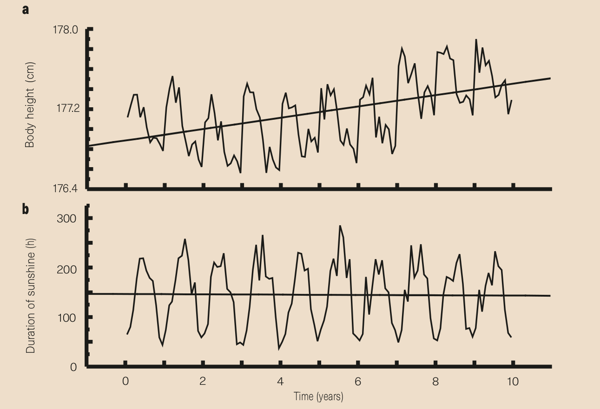
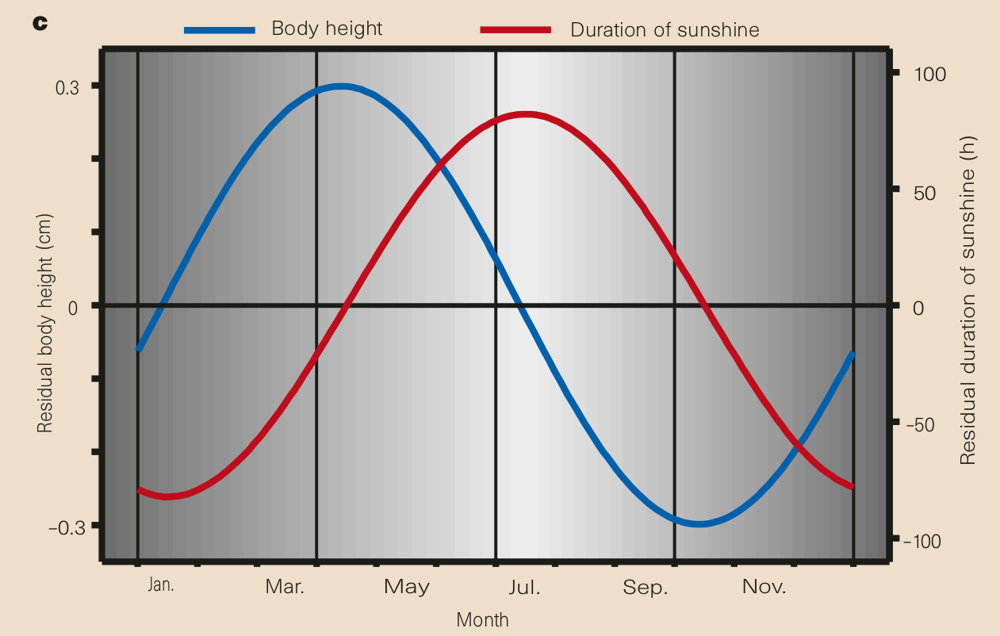

```{r,echo=FALSE}
## Set default options for the knitr RMD processing
knitr::opts_chunk$set(echo=FALSE,warning=FALSE,message=FALSE,fig.width=5,fig.height=5,cache=TRUE,autodep=TRUE, results="hide")
```

```{r libraries,cache=FALSE,echo=FALSE,warning=FALSE,message=FALSE,error=FALSE}
library(tidyverse)
library(cowplot)
```


## Introduction

**Aims:**

 * Give you a jump start
 * Give you good habits
 * Proceed along a helix

---

## Example R session

---

## Workspaces

 Workspace is basically a folder which contains a few special files in
 which R stores project-specific data.

  * `Rhistory` (hidden file) – a text file containing all commands that you
    have issued
  * `Rdata` (hidden file) – a binary file containing your workspace (all
    variables created)
  * `<filename>.Rproj` – Rstudio R project file containing some
    rstudio-specific settings (text file)
  * Anything else should be save by you

---

## Exercise

  * Start R studio $\rightarrow$ File $\rightarrow$ New project
    $\rightarrow$ New directory $\rightarrow$ New project and create a new
    project.
  * Examine the Files pane (lower right); what does it indicate?
  * Try to open the ".Rproj" file in a text editor. 
  * Go to File $\rightarrow$ New File $\rightarrow$ $\rightarrow$ R Script
    to create a new R script.
  * In the new file, write a simple R statement, for example:

```
a <- 1:10
```

   * Press Ctrl/Cmd-Enter. 
   * What happens? What do you see in the console? 
   * What do you see under "Environment" on the top right?

---

## Using R as a git[hub] interface

If you want to download all lecture materials and update it easily when new
lectures come in, do the following:

  * Start R studio $\rightarrow$ File $\rightarrow$ New project
    $\rightarrow$ Version Control $\rightarrow$ Git 
  * Enter `https://github.com/january3/ReproducibleR2021` as the
    "Repository URL"
  * Pay attention to the "Create project as subdirectory of" entry field,
    so that you know where you are saving the project.
  * Click "Create Project". Rstudio will download all available materials.
  * When you want to update / check for updates, go to the "git" tab in the
    top right panel and press the blueish "down" arrow.

 

---

## A few notes on R

 * Why programming?
 * Why R?
 * Alternatives: Python, matlab, other statistical languages
 * R vs matlab
 * "There is more than one way of doing it" (but one way will usually be
   optimal)

---

## R language basics (reminder)

 * Get help with `?` or `help.search`
 * Assignment and variables: `a <- 2` or `myBigVar <- "test"`
  * Note: there are no "singletons", everything is a vector (but maybe of
    length one)
 * vectors and multiple assignment: `a <- c(1, 7, 9)`
 * some of the operators: 
   * `3 + 5` 
   * `a * 7` 
   * `5 / 7` 
   * `5 %% 7` 
   * `5 %/% 7` 
   * `5^7`
   * operators often are "vectorized", that is they work with vectors:
      * `c(1, 5, 7) * 8`
 * functions: `sum(c(1, 2, 3))`
   * basically everything is a function, even the operators

---

## Exercises (reminder)

 * create variables: a string, a number using the `<-` operator
   * how to create the variables?
   * how to view the variables?
 * what does `1:5` do?
 * what happens when you add a number to a vector? (i.e. `c(3, 1, 4) + 5`)
 * what happens when you multiply a vector with a number?
 * what happens when you add two vectors?

---

## R language basics (reminder)

R data types:

 * vector (character, integer, numeric, logical, factor)

    * constructing: with `c` (combine values): `c(1, 2, 5)`
    * accessing elements: `myvector[1]`, `myvector[c(1, 2, 5)]`

--

 * matrix (character, integer, numeric, logical, factor)

   * accessing elements with `mtx[ row, column ]`

--

 * lists: can hold multiple types, can be named

    * accessing elements:

       * by number, e.g. `mylist[[1]]`

       * by name, e.g. `mylist[["element name"]]`

       * using the `$` shortcut: `mylist$some_name`


---

## R language basics (reminder)

R data types:


 * data frames (and such like): special type of lists
    * columns are elements and can be accessed exactly like elements of a
      list
    * in addition, matrix-style `[` operator is defined, but: warning! it
      works slightly differently!

---

## R language basics (reminder)

 * Use the `matrix` function to create a matrix with 5 rows and 2 columns,
   filled with random numbers (use `rnorm` to generate random numbers).
 * convert the matrix to a data frame using `as.data.frame`
 * Add a column with identifiers – first five letters of the alphabet (you
   can use the predefined vector `LETTERS` for it)
 * convert the data frame back to the matrix with `data.matrix`. 
 * What is the value type of the new matrix? (use `class` for this)
 

---

## R as a functional language

 * Everything is a function (even "operators"!)
 * Functional languages and loops do not mix
 * 99% of what you can do with loops you can do better with another
   function

---

## Example: calculating 100 random distributions 

**Task:** Generate 100 vectors, each with 10 random numbers. For each
vector, calculate the mean and SD. Keep the vectors.

--

.pull-left[
```{r, echo=TRUE,eval=FALSE}
samples <- list()
means   <- c()
sds     <- c()
for(i in 1:100) {
  samples[i] <- rnorm(10, mean=1, sd=2)
  means[i]   <- mean(samples[i])
  sds[i]     <- sd(samples[i])
}
```
]

--

.pull-right[
```{r, echo=TRUE,eval=FALSE}
samples <- replicate(100, rnorm(10, mean=1, sd=2))
means   <- sapply(samples, mean)
sds     <- sapply(samples, sd)
```

]

(note: `lapply` returns always a list, `sapply` returns whatever the hell
it thinks it should. Better functions in `tidyverse`)

---

## Exercise: basic use of sapply and lapply

 1. Use `sample` to generate a vector of length 150 containing random
    numbers from 20 to 500.
 2. Apply the `lapply` function to the vector from (1.) to generate 50
    vectors, each of a random length from 20 to 500.
 3. Apply the `sapply` function to the result of (2.) to calculate the
    means and SD's of the 150 vectors.
 4. Use `plot(x, y)` function to plot the means vs vector length (x should
    be the vector from (1.), and y should be the result from (3))


---


## Effect sizes: Does astrology work?

Astrology: date of birth can be used to predict our physical and mental
abilities.

Can date of birth be used to predict our height?

---

## Effect sizes: Does astrology work?

.center[

]

.myfootnote[
*Weber GW, Prossinger H, Seidler H. Height depends on month of birth.
Nature. 1998 Feb;391(6669):754-5.*
]

---

## Effect sizes: Does astrology work?


.center[

]

.myfootnote[
*Weber GW, Prossinger H, Seidler H. Height depends on month of birth.
Nature. 1998 Feb;391(6669):754-5.*
]

---

## Effect sizes: Does astrology work?

 * The observed effect was in the range of 6 mm
 * The standard deviation for human population is ~ 70 mm
 * Other factors (genetic, nutrition) have a much greater effect
 * Simulated comparison (N=`r N<-100000;sprintf("%d", N)`):

.center[
```{r fig.width=15,fig.height=4}
pop1 <- rnorm(N, mean=177 + 0.3, sd=7)
pop2 <- rnorm(N, mean=177 - 0.3, sd=7)
df <- tibble(Height=c(pop1, pop2), "Birth Date"=rep(c("April", "October"), each=N))
ggplot(df, aes(x=Height, fill=.data[["Birth Date"]], color=.data[["Birth Date"]])) + 
  geom_density(alpha=0.2) + theme_cowplot() +
  theme(axis.line=element_blank()) +
  ylab("Density") + 
  geom_vline(xintercept=c(177+0.3, 177-0.3), color=c("#F8766D", "#00BFC4"), size=1, linetype="dashed")
```
]

---

## Effect sizes: Does astrology work?

 * The observed effect was in the range of 6 mm
 * The standard deviation for human population is ~ 70 mm
 * Other factors (genetic, nutrition) have a much greater effect
 * Simulated comparison (N=`r sprintf("%d", N)`), as a boxplot:

.pull-left[
```{r fig.width=5,fig.height=5}
ggplot(df, aes(x=.data[["Birth Date"]], y=Height, fill=.data[["Birth Date"]], color=.data[["Birth Date"]])) + 
  geom_boxplot(alpha=0.2) + theme_cowplot() +
  theme(axis.line=element_blank()) 
```
]

.pull-right[
T-test results:

```{r results="markdown"}
t.test(df$Height ~ df[[2]])
```

$\Rightarrow$ Differences are statistically significant!

]

---

## Simulating effect sizes


